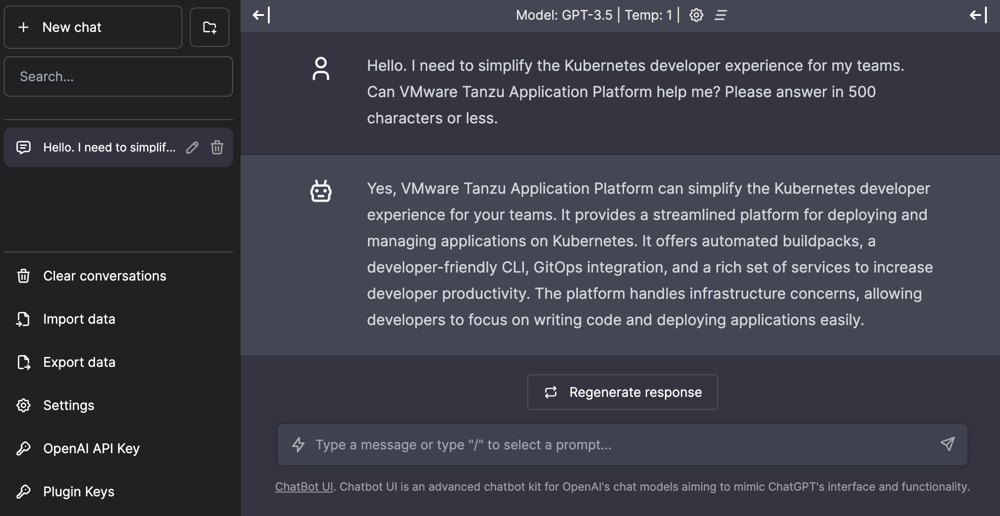

# Welcome to Chatbot UI on TAP!



This project helps you deploy
[Chatbot UI](https://github.com/mckaywrigley/chatbot-ui)
(an open source ChatGPT UI by [@mckaywrigley](https://github.com/mckaywrigley)) to
[VMware Tanzu Application Platform](https://tanzu.vmware.com/application-platform) (TAP).

Why should you use TAP for building and deploying apps to Kubernetes?
Looking at this repository, it should be obvious: you won't find any
Kubernetes manifest files since the platform takes care of providing
the right configuration to deploy your app.

No need to deal with `Deployment`, `Pod` or `Ingress`!

You may deploy existing apps such as Chatbot UI, reusing your Dockerfile
to create container images. Or you may also start from scratch, with no Dockerfile:
the platform will automatically detect language, runtime environment and frameworks
you use, and build container images out of the source code.
Then you can deploy those container images to your favorite cluster
using the generated Kubernetes configuration.

As a developer, just focus on your code!

## How to deploy this app to TAP?

It's quite simple actually, just run this command:

```shell
tanzu apps workload apply -f config/workload.yaml
```

That's it. You're done.

A few minutes later you end up with a live app, and you can start using this UI
with ChatGPT.

Hope it helps!

## Contribute

Contributions are always welcome!

Feel free to open issues & send PR.

## License

Copyright &copy; 2023 [VMware, Inc. or its affiliates](https://vmware.com).

This project is licensed under the [Apache Software License version 2.0](https://www.apache.org/licenses/LICENSE-2.0).
